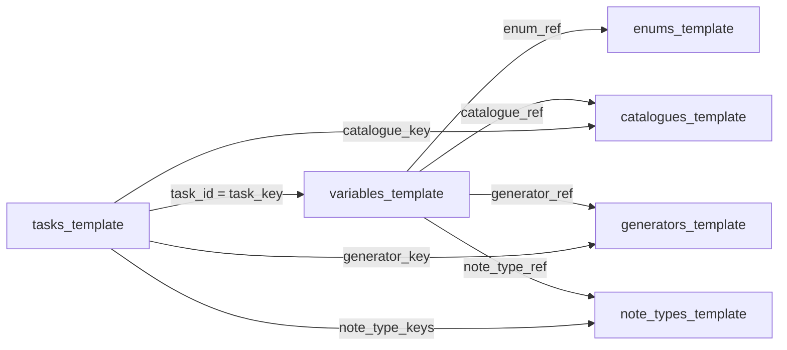

# Plans, features, and capture mapping for diagnostic CSVs

This document summarizes how the [`diag_csv/`](diag_csv/) templates are structured and which variables can reasonably be filled or assisted by an application that captures building dimensions and a 3D map of the property. It is derived from the CSVs under `diag_csv/**` and from the validation rules in [`.cursor/rules/diag-csv-validation.mdc`](.cursor/rules/diag-csv-validation.mdc).

---

## 1. Structure of `diag_csv`

Each **subfolder** corresponds to one French diagnostic (or shared admin) dataset. As of this writing the folders are: `Admin_data`, `Asbestos`, `Electricity`, `Gaz`, `Lead_CREP`, and `termite`.

Each folder is meant to contain **six CSV templates** with aligned column schemas (see the rule file for full column definitions):

| File | Role |
|------|------|
| [`tasks_template.csv`](diag_csv/Gaz/tasks_template.csv) | Mission steps: `task_id`, lifecycle (`lifecycle_phase`, `lifecycle_level`, …), UI (`ui_type`), and links to `catalogue_key`, `generator_key`, or comma-separated `note_type_keys`. |
| [`variables_template.csv`](diag_csv/Gaz/variables_template.csv) | Data fields: `variable_key`, `task_key`, `variable_kind`, `value_source_type`, spatial levels `level_registered_at` / `level_belongs_to`, and optional refs `enum_ref`, `catalogue_ref`, `generator_ref`, `note_type_ref`. |
| [`enums_template.csv`](diag_csv/Gaz/enums_template.csv) | Controlled lists (`enum_key` + `item_value` rows) for enum variables. |
| [`catalogues_template.csv`](diag_csv/Gaz/catalogues_template.csv) | Catalogue definitions for catalogue-driven UI. |
| [`generators_template.csv`](diag_csv/Gaz/generators_template.csv) | Generator definitions for generator-driven UI. |
| [`note_types_template.csv`](diag_csv/Gaz/note_types_template.csv) | Observation / note types keyed by `note_type_key`, referenced from tasks and from variables via `note_type_ref`. |

**Reference flow** (high level):

**Inventory note:** Project validation rules expect all six files in every diagnostic folder. In the current tree, [`diag_csv/Asbestos/`](diag_csv/Asbestos/) has five CSVs (for example no `generators_template.csv`); other folders may be complete. This does not change the intended model above.

---

## 2. What “capturable by the 3D / dimensions app” means here

Variables are treated as **capture-relevant** when one or more of the following applies:

1. **Spatial anchoring** — `level_registered_at` / `level_belongs_to` are `building`, `storey`, `room`, `building_element`, or `object`. Values can be attached to nodes in a digital twin (level, room volume, construction element, or equipment instance).

2. **Geometry-derived** — `number` fields for volume, area, or distance (or future fields of that kind). Example in the templates: `quantification_volume_m3` (Asbestos). Room mesh volume or surface from a scan can **suggest** or **pre-fill** such numbers when methodology allows.

3. **Position / plan / sketch** — Fields that describe *where* something is (`position`, `repère`, `place_on_plan`, `place_on_sketch`, plan references, “localisation sur croquis”). A 3D map supports coordinates, markers, exported plans, or links from photos to poses. For instance, Placing the element through a note placed with the application.

4. **Indirect / contextual** — Report-level-only diagnostics still benefit from linking the mission to the property model (navigation, consistency, “which room am I in?”). That is **not** automatic filling of regulatory checklists.

**Not** inferred from geometry alone (unless you integrate other tools or data): regulatory yes/no grids, owner or client identity fields, contracts, laboratory results, XRF or gas-specific measurements, calibration of lead-measurement devices, and most “compliant / non compliant” enums—these remain **operator judgment** or **instrument / lab** inputs.

---

## 3. Per-diagnostic variables and how the app can help

### 3.1 Admin_data

Spatial levels used: **`building`**, **`room`** (plus case/report elsewhere, not detailed here).

| Group | `variable_key` (examples) | How the capture app helps |
|-------|---------------------------|---------------------------|
| Building plan | `building_plan_image` | Attach a raster export, orthophoto, or screenshot from the 3D/plan pipeline instead of or in addition to a manual scan. |
| Room identity | `room_building_level_designation`, `room_designation` | Map each room instance in the twin to the enum or label expected by admin tasks (building + level + room type/name). |
| Visit exception | `room_non_visit_justification` | If the model marks a space as inaccessible or unscanned, tie that to justification when the operator confirms. |
| Finishes | `room_floor_material`, `room_wall_material`, `room_ceiling_material` | Optional assistance if your pipeline classifies materials (otherwise manual enum pick in context of the selected room). |
| Openings | `room_window_present`, `room_window_type`, `room_door_present`, `room_door_type`, `room_skirting_board_type` | Suggest presence/type from detected openings only if your reconstruction supports it; else capture room context only. |
| Free text | `room_other_information` | Pre-fill with auto-generated room dimensions or labels (e.g. floor area) as **draft** text for the operator to edit. |
| Mission scope | `scope_of_identification` | Cross-check narrative scope (e.g. number of levels) against the storey graph in the model. |
| Geolocation | `property_gps_coordinates` (`value_source_type` computed in template) | Natural fit for GNSS or map-picked coordinates from the field app, if your stack computes this. |

---

### 3.2 Asbestos

Spatial levels: **`building_element`**, **`room`** (and report-level for lab/operator blocks).

| Group | `variable_key` | How the capture app helps |
|-------|----------------|---------------------------|
| Element typing | `asbestos_material` | Associate the selected `building_element` in the twin with the checklist material enum. |
| Conservation state (room) | `conservation_evaluation_material`, `surface_condition_degradation`, `physical_protection`, `air_circulation`, `shocks_vibrations`, `conservation_score_result` | Stored per **room**; the app provides **which room** is active and optional media context—not the regulatory scoring itself. |
| Quantification (room) | `characteristic_type`, `quantification_amount`, `quantification_unit`, **`quantification_volume_m3`**, `quantification_mass_t`, `additional_info` | **`quantification_volume_m3`** is a direct candidate for **room volume from mesh** (with operator confirmation and methodology constraints). |
| Sample note (`sample_note_type`) | `sample_id`, `sample_photo`, `room_location`, `precise_location`, `construction_component`, `part_to_inspect`, `csp_list`, `material_description`, **`place_on_plan`**, `non_regulatory_on_request`, `conclusion_methodology`, `conclusion_status`, `conclusion_justification`, `conclusion_result` | Anchor each sample to a **room** and optionally a **3D point or plan marker**; `place_on_plan` / `precise_location` align with plan or model drops. Photos can be linked to camera pose if the app records it. |
| Lab / collection (room) | `component_number`, `sampling_date`, `sample_identification_number`, `sample_location_detail`, `sample_comments`, `layers_to_analyze`, `layer_details`, `radiation`, `sample_qr_code`, `sample_photo_collection`, **`place_on_sketch`** | **`place_on_sketch`** and `sample_location_detail` map naturally to sketch or 3D placement workflows. |
| Report-only strings | `asbestos_operator_identification`, analysis requester/author, `laboratory_*` (e.g. `laboratory_name`, `laboratory_address`, …) | Not from 3D capture; administrative / lab. |

---

### 3.3 Lead_CREP (plomb)

Spatial levels: **`building`**, **`storey`**, **`room`**; element samples use `note_type_ref` → `lead_element_sample`.

| Group | `variable_key` | How the capture app helps |
|-------|----------------|---------------------------|
| Building | `building_degradation_floor_ceiling_collapse`, `building_degradation_water_damage`, `building_degradation_mold_humidity` | Contextual photos or structured walkthrough may **support** the operator’s boolean answers; they are not automatic from mesh alone. |
| Storey | `rooms_visited`, `unmeasured_room_reason`, `unmeasured_rooms_list` | Derive or validate **visited room lists** from the twin’s per-storey room set. |
| Room (uncontrollable) | `uncontrollable_element_location`, `uncontrollable_element_part`, `uncontrollable_element_reason` | Tie “where” to named spaces or coordinates in the model. |
| Element sample (`lead_element_sample`) | `picture`, **`position`**, **`repere`**, **`height`** (enum in CSV), `UD_name`, `measured_part`, `substrate`, `apparent_coating`, `building_degradation_factors`, **`measurement`**, `Presence_nm_work`, `observations_raison_nm_work`, `nature_degradation`, `state_of_degradation`, `degradation_percentage`, `class` (computed), `lead_element_precision` | **`position`** / **`repere`** are ideal for **3D markers or plan letters**. **`height`** is an enum range: measured ceiling or element height could **suggest** the bucket; **`measurement`** stays device-driven unless integrated. |
| Lab results (report) | e.g. `lab_result_room_name`, `lab_result_plan_reference`, `lab_result_height`, `lab_result_measurement_value`, … | Manual entry or LIMS import; plan reference can mirror app-generated markers. |
| Device / calibration (report) | `device_name`, `calibration_measurement_value`, … | Instrument metadata, not building geometry. |

---

### 3.4 termite

Spatial levels: mostly **`room`**; note type `termite_inspected_element` and catalogue-backed inspection objects.

| Group | `variable_key` | How the capture app helps |
|-------|----------------|---------------------------|
| Inspected element note | `picture`, `observation_text` (`termite_inspected_element`) | Photo + observation anchored to room and optional 3D pose. |
| Inspection object | `location`, `object_type`, `material_details`, `object_part`, `description` | **`location`** and room context from the twin; object/material enums remain operator or catalogue picks unless you add CV. |
| Standardized inspection | `termite_investigation_means`, `termite_presence_indicators`, `termite_infestation_degree`, `termite_species_result`, fungi/parasite blocks, `termite_detection_duration`, etc. | Mostly **checklist / expert** content; app adds **where** in the building the inspection applies. |

---

### 3.5 Gaz

Spatial levels: overwhelmingly **`report`** for installation and administrative tasks; a large **`object`** block for **per-appliance** data (tasks such as `gaz_009`, `gaz_010`).

| Group | `variable_key` (pattern) | How the capture app helps |
|-------|--------------------------|---------------------------|
| Appliance identity & metrics | `appliance_location`, `appliance_name_usage`, `appliance_connection_type`, `appliance_brand`, `appliance_model`, `manufacture_year`, `power_kw`, `measured_flow_l_min` | Each **gas appliance** = an **`object`** instance placed in the correct **room** from the twin; enums/catalogues filled in the field. |
| Appliance checklists | All variables on `gaz_010` with `level_registered_at` = `object` (e.g. `c7_8a1_*` through flue/evacuation items `c24_*`, `d1_*`, `d2_*`, `d3_*`, `d4_*`, …) | Answers remain regulatory; the app ensures **which physical appliance** is being assessed and can attach **photos** or **sketch position**. |
| State note (`gaz_appliance_state_note`) | `appliance_functioning`, `maintenance_contract_present`, `flue_maintenance_proof`, `co_measurement`, **`gas_appliance_localisation_on_sketch`**, `gas_appliance_photo`, `operational_anomaly`, `operational_control` | **`gas_appliance_localisation_on_sketch`** maps directly to a **marker on an exported plan or 3D view**; `gas_appliance_photo` benefits from pose or room linkage. |
| Report-level | e.g. `building_type`, PCE, meter strings, owner fields, global checklists `gaz_004`–`gaz_007`, DGI block | Not geometry-derived; contextual navigation only. |

---

### 3.6 Electricity

In [`diag_csv/Electricity/variables_template.csv`](diag_csv/Electricity/variables_template.csv), variables are registered at **`report` / `report`** only: there is **no room or object decomposition** in the current CSV.

| Topic | Example `variable_key` | How the capture app helps |
|-------|------------------------|---------------------------|
| Whole-installation checklist | `b1_presence_main_breaker`, `b2_presence_rcds`, `b3_*`, `b4_*`, … | No automatic fill from 3D; optional **mission context** (which dwelling, which building slice) if you link reports to a property model. |
| Height-related criterion | `b1_height_180m` (AGCP under 1.80 m) | Could be **observation-assisted** (operator in room with height reference) or future rule-based if you encode clearances in the model; **not** a raw export from “dimensions” without domain rules. |
| Pool / fountain “volumes” | `b10_pool_volume_safety`, `b10_pool_331b`, `b10_fountain_*`, … | Refers to **electrical volume zones** (NF C 15-100 style), not necessarily the same as architectural room volumes—treat as **regulatory**, not mesh-autofill. |

---

## 4. Specific features

### 4.1 Lead (CREP): completeness of reported samples versus visitable elements

In **Lead_CREP**, the operator may choose to document only **problematic** elements (those actually sampled and worth detailing), not every element that could have been sampled. If the final report lists **only** those lines, third parties may read the dossier as **not serious** or as **missing the thoroughness expected** for the mission scope.

**Feature idea:** Use the building / 3D model to know which elements or zones were **visitable** during the mission. For each **visitable** element that has **no** corresponding reported sample row, the system could attach a **synthetic line** in the export by **reusing measurement-like outcomes** drawn at random (or by a defined rule) from among the **samples that were actually reported**, so the rendered report shows coverage aligned with visitable geometry. That makes explicit that “all visitable units are represented” while the operator still only **enters** detail for elements that mattered on site.

**Caveat:** Any extrapolation or placeholder row must stay **traceable** (e.g. flagged as inferred or duplicated from another UD) and must respect **legal and professional rules** for lead diagnostics; random or copied values are not a substitute for real measurements where the norm requires them.

### 4.2 Marking elements that share a property

Several diagnostics ask the operator to **mark** or **group** elements because they **share a specific property** (same substrate, same coating, same UD class, same conservation state, same flue run, etc.).

**Implementation:** The app should support **shared tags**, **multi-select on the twin graph**, or **bulk application** of one property to many selected elements, and should persist that grouping so report generators and PDFs can expand or collapse “classes” of elements consistently. The CSV layer already separates **per-element** variables (`note_type_ref`, room- or object-level keys) from **catalogue** / **enum** lists: product logic should map “mark all X as sharing property P” to those fields without forcing duplicate manual entry on each instance.

---

## 5. Cross-cutting implementation suggestions

- Map `level_registered_at` / `level_belongs_to` to your twin hierarchy (`case` → `report` → `building` → `storey` → `room` → `building_element` / `object`) so the operator never picks a room twice under conflicting keys.
- For variables with `note_type_ref`, persist an internal **pose** (position + orientation), **plan marker id**, or **image–to–floorplan homography** alongside string fields like `position`, `repère`, or `gas_appliance_localisation_on_sketch`.
- Prefer **suggest + confirm** for geometry-derived numbers (`quantification_volume_m3`, future area fields): methodology and normative rules stay authoritative.
- Reuse **one** room graph across diagnostics (Admin + onsite notes) so Lead, Asbestos, termite, and Gaz **object** placement share the same room IDs.
- For Electricity, if you need spatial breakdown later, extend the data model (new tasks/variables at `room` or `object`) rather than overloading report-level fields.

---
