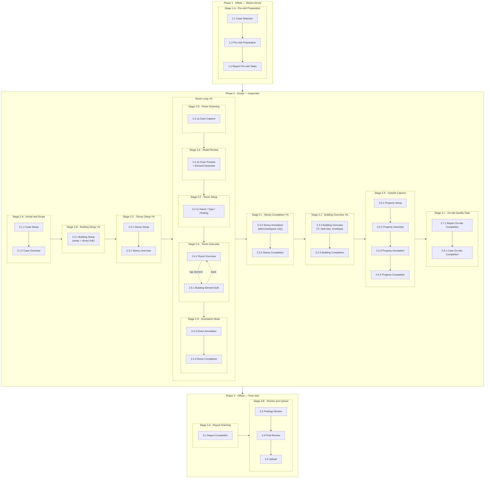
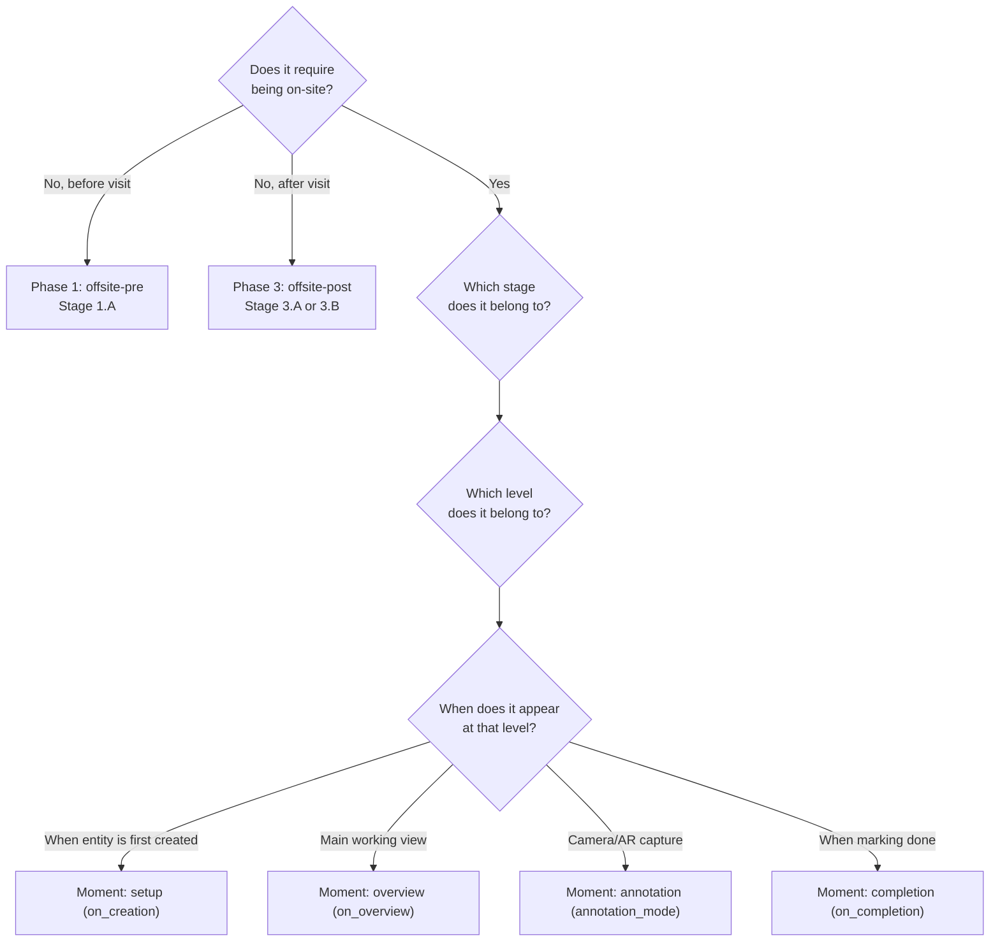

---
aliases:
- Lifecycle Flow
- Surveyor Flow
- Task Timing
- Phase Model
- Inspection Lifecycle
canvas_generator: '[[generate_lifecycle_canvas.py]]'
country: all
created: '2026-02-06'
created_by: unknown
doc_type: ontology
feature_area:
- platform
keywords:
- surveyor flow
- task timing
- master timing reference
- level x moment matrix
- stage model
- lifecycle stages
- offsite-pre
- onsite
- offsite-post
- inspection hierarchy
- workflow definition
- task sequencing
- Plans app
- building inspections
- on_creation
- annotation_mode
- offsite-post tasks
lifecycle:
- offsite-pre/case
- offsite-pre/report
- onsite/case
- onsite/building
- onsite/storey
- onsite/room
- onsite/building_element
- onsite/property
- onsite/report
- offsite-post/report
- offsite-post/case
lifecycle_level:
- building
- building_element
- case
- object
- property
- report
- room
- storey
lifecycle_phase:
- offsite-post
- offsite-pre
- onsite
moments:
- before_arriving
- on_creation
- on_overview
- annotation_mode
- on_completion
- off_site
phases:
- offsite-pre
- onsite
- offsite-post
related:
- '"[[_index\]]"'
- '"[[annotation-mode]]"'
- '"[[annotations-mapping]]"'
- '"[[development-process]]"'
- '"[[feature-areas]]"'
- '"[[generate_lifecycle_canvas.py]]"'
- '"[[individual-project]]"'
- '"[[individual-room]]"'
- '"[[individual-storey]]"'
- '"[[levels]]"'
- '"[[note_types]]"'
- '"[[notes]]"'
- '"[[project-creation]]"'
- '"[[projects]]"'
- '"[[room-scan-review]]"'
- '"[[room-scanning]]"'
- '"[[setting-materials-at-room-level]]"'
- '"[[storey-primaries]]"'
report_domain:
- condition
- epc
- electrical
status: active
steward: unknown
summary: Ontology for the App Lifecycle, detailing the end-to-end surveyor workflow
  from case selection through on-site inspection to report upload. Establishes the
  master timing reference for all product features by mapping tasks to a four-dimensional
  model — phase, stage, level, and moment. Stages are the primary organizing unit
  for opportunity mapping and customer journey analysis.
tags:
- ontology
- definition
- product
- lifecycle
- phases
- stages
title: App Lifecycle
updated: '2026-02-18'
---

# App Lifecycle

The app lifecycle defines the end-to-end flow a surveyor follows — from case selection through on-site inspection to report upload. It is the **master timing reference** for the entire product: every task, screen, component, and feature exists at a specific point in this lifecycle.

> [!tip] How to use this document
> - **Product / Design:** Use stages to locate *where in the customer journey* a problem or feature belongs. Use the phase model to decide the top-level context. Use steps for precise placement.
> - **Engineering:** Use the step metadata to understand entry/exit conditions and which tasks appear.
> - **Opportunity mapping / OST:** Organize opportunities by **stage** — the granular working episode where the pain is felt. Do not organize by feature area; feature areas are routing tags, not journey structure.
> - **Domain modelling:** Use the stage + level + moment coordinate to place report tasks. The step YAML blocks are the authoritative coordinate source.
> - **Development process:** Cross-reference with [[feature-areas]] to know *which product feature area* is active at each lifecycle point, and with [[development-process]] for how work flows through coreness and lanes.
> - **Canvas view:** Run `tools/generate_lifecycle_canvas.py` to produce an Obsidian `.canvas` file from this document.

---

## Conceptual model

The lifecycle has four dimensions:

1. **Phase** — the temporal stage of the visit: before, during, or after the site inspection.
2. **Stage** — a coherent working episode within a phase, where the surveyor has a single clear goal. Stages are the primary organizing unit for opportunity mapping and customer journey analysis. They are report-agnostic: the same stages occur regardless of which reports are active; report-specific tasks are injected into stages via report configuration.
3. **Level** — *where* in the [[levels|inspection hierarchy]] the work happens (case, building, storey, room, etc.).
4. **Moment** — *when* within a level the work appears (setup, overview, annotation, completion).

Steps are the atomic units that live at a specific **phase → stage → level → moment** coordinate.

### The three phases

| Phase | ID | Timing | Description |
| --- | --- | --- | --- |
| **Offsite — Before Arrival** | `offsite-pre` | Before the surveyor travels to the property | Case creation, report selection, pre-visit preparation |
| **Onsite — Inspection** | `onsite` | While the surveyor is physically at the property | The core work: scanning, data entry, annotation, completion per level |
| **Offsite — Post-Visit** | `offsite-post` | After the surveyor leaves the property | Report finishing, findings review, quality check, upload |

### The 14 stages

Stages are report-agnostic. Report-specific tasks hang off stage coordinates as configuration hooks — the stage structure itself does not branch per report type.

| Stage | ID | Phase | Repeats | Surveyor goal |
| --- | --- | --- | --- | --- |
| **Pre-visit Preparation** | `1.A` | offsite-pre | Once | Arrive on-site prepared |
| **Arrival and Scope** | `2.A` | onsite | Once | Confirm scope and enter on-site mode |
| **Building Setup** | `2.B` | onsite | × building | Define building structure; navigate into storeys |
| **Storey Setup** | `2.C` | onsite | × storey | Identify the floor; navigate into rooms |
| **Room Scanning** | `2.D` | onsite | × room | Capture room geometry with LiDAR |
| **Model Review** | `2.E` | onsite | × room | Validate 3D model; confirm building elements |
| **Room Setup** | `2.F` | onsite | × room | Configure room name, type, and heating fields |
| **Room Overview** | `2.G` | onsite | × room | Assign materials; complete room-level tasks |
| **Annotation Mode** | `2.H` | onsite | × room | Capture all on-site observations |
| **Storey Completion** | `2.I` | onsite | × storey | Complete storey; annotate open-space storeys |
| **Building Overview** | `2.J` | onsite | × building | Enter TI, heat loss, and envelope data; close building |
| **Outside Capture** | `2.K` | onsite | Once | Capture exterior and property observations |
| **On-site Quality Gate** | `2.L` | onsite | Once | Leave with complete data |
| **Report Finishing** | `3.A` | offsite-post | × report | Complete off-site report tasks |
| **Review and Upload** | `3.B` | offsite-post | Once | Final review and submission |

### Moments within a level

When the surveyor enters a level (e.g. a room), work unfolds in a predictable sequence of **moments**. Not every level uses every moment — see the matrix below.

| Moment | ID | What triggers it | What happens |
| --- | --- | --- | --- |
| **Pre-visit** | `before_arriving` | Before the surveyor travels to the property | Questionnaires, prep data entry, case review |
| **Setup** | `on_creation` | A new entity is created or opened for the first time | Guided configuration: naming, defaults, scanning, initial fields |
| **Overview** | `on_overview` | Setup is complete and the entity is ready for work | Main working view: task list, child entities, status dashboard |
| **Annotation** | `annotation_mode` | Surveyor enters camera/AR capture mode | Observation capture: photos, measurements, spatial notes per report |
| **Completion** | `on_completion` | Surveyor taps "Mark Done" or all child entities are complete | Validation, summary, confirmation before closing the entity |
| **Off-site** | `off_site` | After the surveyor leaves the property | Report finishing, summaries, recommendations, quality review |

> [!note] Zones and the lifecycle
> **Zones** are not levels in the lifecycle. They are cross-hierarchy overlays — groupings of arbitrary entities. Zones interact with the lifecycle in two ways:
> 1. **Assignment:** Zones are created and entities are assigned to them during the inspection (e.g., the surveyor marks rooms 1-3 as "heated zone A" during building overview).
> 2. **Validation:** At level completion, the system checks zone-level coverage rules (e.g., "every heated zone must have at least one temperature measurement").
>
> See [[levels#Zone -- cross-hierarchy overlay]] for the zone concept definition.

---

## Master flow



---

## Phase 1 · Offsite — Before Arrival

Steps the surveyor performs remotely before travelling to the property.

---

### Stage 1.A · Pre-visit Preparation

The surveyor selects or creates the case, reviews requirements, and completes any tasks that can be done before arriving on-site. Pre-visit is report-agnostic at the stage level: different report types each contribute their own pre-visit tasks, but the surveyor works through them as one unified preparation activity.

---

#### 1.1 · case.selection — Case Selection

```yaml
step:
  id: case.selection
  stage: 1.A
  phase: offsite-pre
  level: case
  moment: before_arriving
  order: "1.1"
  parent: offsite-pre
  repeats: false
```

**Description:** The surveyor creates a new case or selects an existing one from the case list. A case represents a single property inspection job, potentially spanning multiple report types.

**User goal:** Identify which property to inspect and which reports to produce.

**Entry trigger:** Surveyor opens the app and navigates to the cases list, or receives a case assignment.

**Exit trigger:** A case exists with at least one report type selected.

**Tasks at this step:**

- Create or select case
- Select report types to produce (e.g. Condition Report, EPC, Electrical)
- Enter property address and basic identifiers

**UI patterns:** list-selection · form

**Design refs:** [[projects]] · [[project-creation]]

**Screen refs:** [[projects|Case list]] · [[individual-project|Case detail]]

---

#### 1.2 · case.pre-visit — Pre-visit Preparation

```yaml
step:
  id: case.pre-visit
  stage: 1.A
  phase: offsite-pre
  level: case
  moment: before_arriving
  order: "1.2"
  parent: offsite-pre
  repeats: false
```

**Description:** Before leaving for the site, the surveyor reviews the case, checks report requirements, and handles any tasks that can be completed remotely (e.g. reviewing floor plans, checking previous reports, confirming equipment).

**User goal:** Arrive on-site prepared, with all pre-work done.

**Entry trigger:** Case is created and reports are selected.

**Exit trigger:** Surveyor is satisfied that pre-visit tasks are handled and is ready to travel.

**Tasks at this step:**

- Review report requirements per selected report type
- Complete `before_arriving` tasks defined by the report configuration
- Download any required offline data (catalogues, templates)

**UI patterns:** checklist · task-list

**Design refs:** [[individual-project]]

**Screen refs:** —

---

#### 1.3 · report.pre-visit — Report Pre-visit Tasks

```yaml
step:
  id: report.pre-visit
  stage: 1.A
  phase: offsite-pre
  level: report
  moment: before_arriving
  order: "1.3"
  parent: offsite-pre
  repeats: true
  repeats_per: report
```

**Description:** Report-specific tasks that can be completed before arriving on-site. Most commonly questionnaires filled by the homeowner (e.g. the seller questionnaire for Danish Condition, or the occupant questionnaire for Electrical). The surveyor or the homeowner fills these remotely; the surveyor reviews and can edit on-site if incomplete. When multiple reports are selected, each may contribute its own pre-visit tasks — they are often presented together since they overlap.

**User goal:** Ensure all pre-visit data collection is done so the on-site inspection can focus on physical observation.

**Entry trigger:** Reports are selected and homeowner has been notified (or surveyor begins pre-visit prep).

**Exit trigger:** All pre-visit tasks for all selected reports are complete or acknowledged as pending.

**Tasks at this step:**

- Seller/occupant questionnaires (per report type)
- External data prefill (e.g. BBR lookup, prior inspection data)
- Inspection metadata (date, time, reference numbers)

**UI patterns:** questionnaire · form · checklist

**Design refs:** —

**Screen refs:** —

---

## Phase 2 · Onsite — Inspection

The surveyor is physically at the property, moving through buildings, storeys, and rooms.

---

### Stage 2.A · Arrival and Scope

The surveyor arrives at the property, opens the case, and confirms the inspection scope. This is a brief transition stage — if the case was prepared offsite, it may take less than a minute.

---

#### 2.1.1 · case.setup — Case Setup

```yaml
step:
  id: case.setup
  stage: 2.A
  phase: onsite
  level: case
  moment: on_creation
  order: "2.1.1"
  parent: onsite.case
  repeats: false
```

**Description:** On arrival, the surveyor opens the case and confirms or adjusts the report selection. This is the entry point for on-site work. If the case was prepared offsite, this step may be brief.

**User goal:** Confirm the inspection scope and transition into on-site mode.

**Entry trigger:** Surveyor arrives at the property and opens the case.

**Exit trigger:** Reports are confirmed and the surveyor is ready to begin the inspection.

**Tasks at this step:**

- Confirm or adjust selected reports
- Verify property address and basic info
- Set any case-level defaults

**UI patterns:** confirmation-screen · form

**Design refs:** [[individual-project]]

**Screen refs:** [[individual-project|Case overview]]

---

#### 2.1.2 · case.overview — Case Overview

```yaml
step:
  id: case.overview
  stage: 2.A
  phase: onsite
  level: case
  moment: on_overview
  order: "2.1.2"
  parent: onsite.case
  repeats: false
```

**Description:** The case dashboard showing all buildings, progress per report, and navigation into child levels. This is the hub the surveyor returns to between buildings.

**User goal:** See overall progress and navigate to the next building or area to inspect.

**Entry trigger:** Case setup is complete, or surveyor returns from a completed building.

**Exit trigger:** Surveyor taps into a building to begin or continue its inspection.

**Tasks at this step:**

- View case-level task completion status
- Add or select a building
- Monitor overall report progress

**UI patterns:** dashboard · navigation-list

**Design refs:** [[individual-project]]

**Screen refs:** [[individual-project|Case dashboard]]

---

### Stage 2.B · Building Setup

The surveyor creates and configures each building, then uses it as the navigation hub while working through its storeys.

---

#### 2.2.1 · building.setup — Building Setup

```yaml
step:
  id: building.setup
  stage: 2.B
  phase: onsite
  level: building
  moment: on_creation
  order: "2.2.1"
  parent: onsite.building
  repeats: true
  repeats_per: building
```

**Description:** When a new building is created, the surveyor enters building-level defaults: name, construction year, building type, number of storeys. The app may pre-populate from previous inspections or external data. Storeys are added here or auto-generated. After initial setup, this step continues to serve as the **navigation hub**: the surveyor returns here between storeys to track completion status and descend into the next storey. Building-level tasks other than structure setup live in Stage 2.J (Building Overview).

**User goal:** Define the building structure and navigate through its storeys.

**Entry trigger:** Surveyor taps "Add Building" from the case overview, or opens an unconfigured building.

**Exit trigger (initial):** Building defaults are saved and at least one storey exists.

**Exit trigger (between storeys):** Surveyor descends into the next storey, or all storeys are complete and the surveyor proceeds to Stage 2.J.

**Tasks at this step:**

- Name the building
- Set building year and type
- Configure building-level defaults (varies by report)
- Add storeys (manual or auto-generate)
- View storey list with completion status
- Navigate into next storey

**UI patterns:** wizard · form · dashboard · navigation-list

**Design refs:** —

**Screen refs:** —

---

### Stage 2.C · Storey Setup

The surveyor names each storey and navigates into its rooms.

---

#### 2.3.1 · storey.setup — Storey Setup

```yaml
step:
  id: storey.setup
  stage: 2.C
  phase: onsite
  level: storey
  moment: on_creation
  order: "2.3.1"
  parent: onsite.storey
  repeats: true
  repeats_per: storey
```

**Description:** The surveyor names the storey (e.g. "Ground Floor", "1st Floor", "Basement") and sets any storey-level fields. This is typically a brief step.

**User goal:** Identify the floor so rooms can be grouped under it.

**Entry trigger:** Surveyor taps "Add Storey" from building setup, or selects an unconfigured storey.

**Exit trigger:** Storey name is set and the surveyor is ready to scan rooms.

**Tasks at this step:**

- Name the storey
- Set storey-level fields (varies by report)

**UI patterns:** form (minimal)

**Design refs:** [[storey-primaries]]

**Screen refs:** [[individual-storey]]

---

#### 2.3.2 · storey.overview — Storey Overview

```yaml
step:
  id: storey.overview
  stage: 2.C
  phase: onsite
  level: storey
  moment: on_overview
  order: "2.3.2"
  parent: onsite.storey
  repeats: true
  repeats_per: storey
```

**Description:** Shows the list of rooms on this floor, their scan/completion status, and any storey-level tasks. The surveyor adds rooms and navigates into them for scanning and annotation.

**User goal:** Track which rooms on this floor are done and navigate to the next room to scan.

**Entry trigger:** Storey setup is complete, or surveyor returns from a completed room.

**Exit trigger:** Surveyor taps into a room, or all rooms are done and the surveyor proceeds to Stage 2.I.

**Tasks at this step:**

- View room list with completion status
- Add new rooms
- Storey-level report tasks (if any)

**UI patterns:** dashboard · navigation-list

**Design refs:** [[storey-primaries]]

**Screen refs:** [[individual-storey|Storey overview]]

---

### Stage 2.D · Room Scanning

The surveyor performs the physical LiDAR scan. Stages 2.D, 2.E, and 2.F all map to step `2.4.1 room.setup` — three cognitive modes within one lifecycle coordinate.

---

#### 2.4.1 · room.setup — Room Scanning

```yaml
step:
  id: room.setup
  stage: 2.D
  phase: onsite
  level: room
  moment: on_creation
  order: "2.4.1"
  parent: onsite.room
  repeats: true
  repeats_per: room
```

**Description:** The surveyor scans the room using the device camera and LiDAR sensor (RoomPlan). This step spans three stages: 2.D (scan capture), 2.E (model review), and 2.F (room configuration).

**Entry trigger:** Surveyor taps "Add Room" or "Scan Room" from the storey overview.

**Exit trigger:** Room name, type, and required fields are set and the room is ready for material assignment.

**Tasks at this step:**

- Initiate room scan (RoomPlan / LiDAR spatial capture)
- Real-time spatial capture with live mesh preview

**UI patterns:** scan-capture · scan-preview · wizard · form

**Design refs:** [[room-scanning]] · [[room-scan-review]] · [[setting-materials-at-room-level]]

**Screen refs:** [[room-scanning|Scan capture]] · [[room-scan-review|Scan preview]]

---

### Stage 2.E · Model Review

The surveyor reviews the captured 3D model, confirms detected building elements, and decides whether to accept or re-scan.

#### 2.4.1 · room.setup — Model Review

```yaml
step:
  id: room.setup
  stage: 2.E
  phase: onsite
  level: room
  moment: on_creation
  order: "2.4.1e"
  parent: onsite.room
  repeats: true
  repeats_per: room
```

**Tasks at this step:**

- View scan result in scan preview screen
- Accept scan, trigger re-scan, or adjust geometry
- Review auto-detected building elements (walls, floor, ceiling, windows, doors)
- Confirm or correct element types from scan detection
- Optionally scan ceiling (separate capture if needed)

**UI patterns:** scan-preview · element-confirmation

---

### Stage 2.F · Room Setup

The surveyor configures the room's identity and report fields.

#### 2.4.1 · room.setup — Room Configuration

```yaml
step:
  id: room.setup
  stage: 2.F
  phase: onsite
  level: room
  moment: on_creation
  order: "2.4.1f"
  parent: onsite.room
  repeats: true
  repeats_per: room
```

**Tasks at this step:**

- Name room and set room type
- Set heating system, whether addition, and other room-level fields (varies by report)
- Confirm or adjust building element areas (auto-calculated from scan or manual)

**UI patterns:** wizard · form

---

### Stage 2.G · Room Overview

The surveyor assigns materials to surfaces and completes room-level tasks. Building elements in the 3D model can be tapped for detailed editing.

---

#### 2.4.2 · room.overview — Room Overview

```yaml
step:
  id: room.overview
  stage: 2.G
  phase: onsite
  level: room
  moment: on_overview
  order: "2.4.2"
  parent: onsite.room
  repeats: true
  repeats_per: room
```

**Description:** The room's main working view after scanning. Shows the 3D model with building elements, the material assignment interface, and room-level tasks. The surveyor confirms materials for each building element surface and completes any room-level data entry. Tapping a building element in the 3D model navigates to the building element edit view (step 2.5.1).

**User goal:** Assign materials to surfaces and complete room-level tasks before entering annotation mode.

**Entry trigger:** Room setup (Stage 2.F) is complete.

**Exit trigger:** Required materials are confirmed and the surveyor enters annotation mode, or navigates to a building element.

**Tasks at this step:**

- Confirm building element materials (per surface)
- Room-level report tasks (varies by report type)
- View 3D model with building elements
- Navigate to building element edit (tap on 3D model)

**UI patterns:** 3d-model-view · material-assignment · task-list

**Design refs:** [[setting-materials-at-room-level]] · [[individual-room]]

**Screen refs:** [[individual-room|Room overview]] · [[setting-materials-at-room-level|Material assignment]]

---

#### 2.5.1 · building-element.overview — Building Element Edit

```yaml
step:
  id: building-element.overview
  stage: 2.G
  phase: onsite
  level: building_element
  moment: on_overview
  order: "2.5.1"
  parent: onsite.building-element
  repeats: true
  repeats_per: building_element
  entered_from: room.overview
```

**Description:** The surveyor taps a building element in the room's 3D model to open its detail view. Here they edit properties: element type (wall, ceiling, window, etc.), material, area, insulation, and report-specific fields. Changes are saved inline and the surveyor returns to the room overview.

**User goal:** Set or correct the properties of a specific building element.

**Entry trigger:** Surveyor taps a surface/element in the 3D model view during room overview.

**Exit trigger:** Surveyor saves changes and returns to room overview (back navigation).

**Tasks at this step:**

- Set element type (if not auto-detected)
- Set or confirm material
- Set area (auto-calculated from scan or manual)
- Report-specific element fields (e.g. insulation type, U-value)

**UI patterns:** detail-form · inline-edit

**Design refs:** —

**Screen refs:** —

> [!note] Non-linear access
> Building elements are the only level accessed non-linearly. The surveyor can tap any element in the 3D model at any time during room overview. There is no fixed order.

---

### Stage 2.H · Annotation Mode

The surveyor enters camera-based observation capture for all active reports, then marks the room complete.

---

#### 2.4.3 · room.annotation — Room Annotation

```yaml
step:
  id: room.annotation
  stage: 2.H
  phase: onsite
  level: room
  moment: annotation_mode
  order: "2.4.3"
  parent: onsite.room
  repeats: true
  repeats_per: room
```

**Description:** The surveyor enters camera-based annotation mode. The live camera feed (with optional AR overlay) lets the surveyor capture observations as [[note_types]]: photos with spatial placement, defect markers, measurements, and other report-specific notes. Each report type defines which note types are available.

**User goal:** Capture all on-site observations for this room across all active reports.

**Entry trigger:** Surveyor taps "Annotate" or the app transitions after materials are confirmed.

**Exit trigger:** All required annotation tasks are complete, or surveyor manually exits annotation mode.

**Tasks at this step:**

- Capture notes per report type (photo + form + optional AR placement)
- Per-note-type wizard flows (catalogue selection, field entry)
- Spatial annotation (place markers on surfaces)
- Review captured notes in the annotation list

**UI patterns:** camera-overlay · ar-placement · note-capture-wizard · note-list

**Design refs:** [[annotation-mode]] · [[annotations-mapping]] · [[notes]]

**Screen refs:** [[annotation-mode|Camera overlay]] · [[notes|Note list]]

---

#### 2.4.4 · room.completion — Room Completion

```yaml
step:
  id: room.completion
  stage: 2.H
  phase: onsite
  level: room
  moment: on_completion
  order: "2.4.4"
  parent: onsite.room
  repeats: true
  repeats_per: room
```

**Description:** Triggered when the surveyor marks the room as done. The app validates that all required tasks and annotations for this room are complete across all active reports. Missing items are surfaced for resolution.

**User goal:** Confirm this room is fully inspected and move to the next room or return to the storey.

**Entry trigger:** Surveyor taps "Finish Room" or exits annotation mode with all tasks complete.

**Exit trigger:** Room is marked complete. Surveyor returns to storey overview (Stage 2.C) to scan the next room or proceed to Stage 2.I.

**Tasks at this step:**

- Validation of required room-level tasks
- Validation of required annotations per report
- Review of flagged or incomplete items
- Confirmation prompt

**UI patterns:** validation-summary · confirmation-screen

**Design refs:** —

**Screen refs:** —

---

### Stage 2.I · Storey Completion

After all rooms are done, the surveyor closes the storey. For attics and crawlspaces, annotation happens here at storey level rather than inside individual rooms.

---

#### 2.3.3 · storey.annotation — Storey Annotation

```yaml
step:
  id: storey.annotation
  stage: 2.I
  phase: onsite
  level: storey
  moment: annotation_mode
  order: "2.3.3"
  parent: onsite.storey
  repeats: true
  repeats_per: storey
  conditional: storey_type in [attic, crawlspace]
```

**Description:** Camera-based annotation mode for storey-level inspections. This step is **conditional**: it only activates for open-space storeys modelled as a whole (attics, crawlspaces) rather than broken into discrete rooms. For standard storeys, this step is skipped and the surveyor proceeds directly to storey completion.

**User goal:** Capture observations for open-space storeys where room-by-room scanning is not practical.

**Entry trigger:** All rooms on this storey are complete, and storey type is attic or crawlspace.

**Exit trigger:** All required storey-level annotation tasks are complete.

**Tasks at this step:**

- Attic inspection and defect capture (conditional on storey type = attic)
- Crawlspace inspection and defect capture (conditional on storey type = crawlspace)
- Storey-level observation notes per report type

**UI patterns:** camera-overlay · inspection-assistant · note-capture-wizard

**Design refs:** —

**Screen refs:** —

---

#### 2.3.4 · storey.completion — Storey Completion

```yaml
step:
  id: storey.completion
  stage: 2.I
  phase: onsite
  level: storey
  moment: on_completion
  order: "2.3.4"
  parent: onsite.storey
  repeats: true
  repeats_per: storey
```

**Description:** Triggered when the surveyor marks the storey as done or all rooms and storey-level annotations are complete. Validates that all work on this floor is finished before returning to the building.

**User goal:** Confirm this floor is fully inspected and return to the building level.

**Entry trigger:** All rooms on this storey are marked complete and storey annotation (if applicable) is done.

**Exit trigger:** Storey is marked complete. Surveyor returns to Building Setup (Stage 2.B) to begin the next storey or proceed to Stage 2.J.

**Tasks at this step:**

- Validation of room completion
- Validation of storey annotation (if applicable)
- Review of flagged items on this floor

**UI patterns:** validation-summary · confirmation-screen

**Design refs:** —

**Screen refs:** —

---

### Stage 2.J · Building Overview

After all storeys are complete, the surveyor enters building-level data: technical installations, heat loss, and envelope. This is distinct from Stage 2.B — all rooms must be done before this data can be accurately filled in.

---

#### 2.2.2 · building.overview — Building Overview

```yaml
step:
  id: building.overview
  stage: 2.J
  phase: onsite
  level: building
  moment: on_overview
  order: "2.2.2"
  parent: onsite.building
  repeats: true
  repeats_per: building
```

**Description:** The building's structured data entry view, reached after all storeys are complete. The surveyor enters building-level report tasks: technical installations, heat loss configuration, and building envelope data. This step does not include storey navigation — that lives in Stage 2.B (Building Setup).

**User goal:** Complete building-level data entry before closing the building.

**Entry trigger:** All storeys are marked complete (Stage 2.I done for all storeys in this building).

**Exit trigger:** All building-level report tasks are complete and the surveyor is ready to mark the building done.

**Tasks at this step:**

- Technical installations (building scope: heating systems, hot water, ventilation, renewables)
- Heat loss configuration (building envelope, U-values, thermal bridges)
- Building-level report tasks (varies by report type)
- Review completion progress per report

**UI patterns:** task-list · form · dashboard

**Design refs:** —

**Screen refs:** —

---

#### 2.2.3 · building.completion — Building Completion

```yaml
step:
  id: building.completion
  stage: 2.J
  phase: onsite
  level: building
  moment: on_completion
  order: "2.2.3"
  parent: onsite.building
  repeats: true
  repeats_per: building
```

**Description:** Triggered when the surveyor marks the building as done. The app validates that all required building-level tasks are finished and surfaces any missing data.

**User goal:** Confirm the building inspection is complete and return to the case level.

**Entry trigger:** All building-level tasks in Stage 2.J are complete, or surveyor manually triggers "Finish Building."

**Exit trigger:** Building is marked complete. Surveyor returns to case overview (Stage 2.A) or proceeds to the next building (Stage 2.B).

**Tasks at this step:**

- Validation of required building-level tasks
- Validation of building annotation completion
- Review of incomplete or flagged items
- Confirmation prompt

**UI patterns:** validation-summary · confirmation-screen

**Design refs:** —

**Screen refs:** —

---

### Stage 2.K · Outside Capture

The surveyor works outside: building exterior, garden, shared areas. Happens after all buildings are complete — the surveyor works inside-out.

---

#### 2.6.1 · property.setup — Property Setup

```yaml
step:
  id: property.setup
  stage: 2.K
  phase: onsite
  level: property
  moment: on_creation
  order: "2.6.1"
  parent: onsite.property
  repeats: false
```

**Description:** The surveyor sets property-level settings: property type, plot characteristics, shared areas, and captures reference photos (front of house, street view). For multi-building properties, reference photos may be taken per building.

**User goal:** Record the property context that frames the entire inspection.

**Entry trigger:** All buildings are marked complete, or surveyor navigates to property level from case overview.

**Exit trigger:** Property settings are saved and reference photos are captured.

**Tasks at this step:**

- Set property settings (type, plot, shared areas)
- Capture reference photos per building (front of house)
- Property-level report fields (varies by report)

**UI patterns:** form · photo-capture

**Design refs:** —

**Screen refs:** —

---

#### 2.6.2 · property.overview — Property Overview

```yaml
step:
  id: property.overview
  stage: 2.K
  phase: onsite
  level: property
  moment: on_overview
  order: "2.6.2"
  parent: onsite.property
  repeats: false
```

**Description:** The property's main working view for outside/site-level tasks. Shows property-level tasks, any outside scanning requirements, and status.

**User goal:** Complete property-level data entry and outside tasks.

**Entry trigger:** Property setup is complete.

**Exit trigger:** Property-level tasks are done and the surveyor is ready for outside annotation.

**Tasks at this step:**

- Outside building element tasks
- Property-level technical installations (if applicable)
- Outside scanning (multi-scan for townhouses/terraces)

**UI patterns:** task-list · dashboard

**Design refs:** —

**Screen refs:** —

---

#### 2.6.3 · property.annotation — Property Annotation (Outside)

```yaml
step:
  id: property.annotation
  stage: 2.K
  phase: onsite
  level: property
  moment: annotation_mode
  order: "2.6.3"
  parent: onsite.property
  repeats: false
```

**Description:** Camera-based annotation mode for outside observations. The surveyor captures exterior notes: facade condition, roof observations, drainage, external installations, and report-specific outside notes. Works the same as room annotation but in an outdoor context (AR may be limited).

**User goal:** Capture all outside observations required by the active reports.

**Entry trigger:** Property overview tasks are done, or surveyor manually enters outside annotation mode.

**Exit trigger:** All required outside annotations are captured.

**Tasks at this step:**

- Capture outside notes per report type
- Exterior condition observations
- Report-specific outside annotations

**UI patterns:** camera-overlay · note-capture-wizard · note-list

**Design refs:** [[annotation-mode]]

**Screen refs:** —

---

#### 2.6.4 · property.completion — Property Completion

```yaml
step:
  id: property.completion
  stage: 2.K
  phase: onsite
  level: property
  moment: on_completion
  order: "2.6.4"
  parent: onsite.property
  repeats: false
```

**Description:** Triggered when the surveyor finishes all outside work. Validates that property-level tasks and annotations are complete.

**User goal:** Confirm outside work is done and proceed to on-site closure.

**Entry trigger:** All property-level tasks and annotations are complete.

**Exit trigger:** Property is marked complete. The surveyor transitions to Stage 2.L.

**Tasks at this step:**

- Validation of property-level tasks
- Validation of outside annotations
- Confirmation prompt

**UI patterns:** validation-summary · confirmation-screen

**Design refs:** —

**Screen refs:** —

---

### Stage 2.L · On-site Quality Gate

Final checks while still at the property — the surveyor can still go back to fix things. Per-report checks first, then the case-level "safe to leave" gate.

---

#### 2.7.1 · report.on-completion — Report On-site Completion

```yaml
step:
  id: report.on-completion
  stage: 2.L
  phase: onsite
  level: report
  moment: on_completion
  order: "2.7.1"
  parent: onsite.closure
  repeats: true
  repeats_per: report
```

**Description:** For each active report, the app runs an on-site completion check while the surveyor is still at the property. This surfaces report-specific validation: self-regulation questions, inspection time checks, general remarks, and any report-level closing tasks. Because the surveyor is still on-site, they can immediately go back and rectify issues. This is the critical "last chance" quality gate before leaving.

**User goal:** Verify each report's on-site work is complete while there is still opportunity to fix things.

**Entry trigger:** Property completion is done (all physical inspection work finished).

**Exit trigger:** Report-level on-site checks pass, or surveyor acknowledges remaining items and chooses to continue.

**Tasks at this step:**

- Self-regulation questions (e.g. Danish Condition: inspection duration, general comments)
- Report-specific completion validation
- On-site quality checks per report
- Actionable remediation prompts ("Room X is missing annotation Y — go back?")

**UI patterns:** validation-checklist · remediation-prompts · report-switcher

**Design refs:** —

**Screen refs:** —

---

#### 2.8.1 · case.on-completion — Case On-site Completion

```yaml
step:
  id: case.on-completion
  stage: 2.L
  phase: onsite
  level: case
  moment: on_completion
  order: "2.8.1"
  parent: onsite.closure
  repeats: false
```

**Description:** The final on-site step before the surveyor leaves the property. A case-wide validation confirming that all reports, all levels, and all on-site tasks are complete. Shows a summary of work done, any outstanding items, and a clear "Leave site" action.

**User goal:** Be confident that all on-site work is done and it is safe to leave the property.

**Entry trigger:** All report-level on-site completion checks are done.

**Exit trigger:** Surveyor confirms they are done on-site. Transitions to Phase 3 (offsite-post).

**Tasks at this step:**

- Case-wide completion summary (all reports, all levels)
- Outstanding item list with severity (blocking vs advisory)
- "Leave site" confirmation

**UI patterns:** summary-dashboard · completion-checklist · confirmation-screen

**Design refs:** —

**Screen refs:** —

---

## Phase 3 · Offsite — Post-Visit

The surveyor is at the desk, finishing reports and submitting.

---

### Stage 3.A · Report Finishing

The surveyor completes off-site tasks and reviews auto-generated content.

---

#### 3.1 · case.report-completion — Report Completion

```yaml
step:
  id: case.report-completion
  stage: 3.A
  phase: offsite-post
  level: case
  moment: off_site
  order: "3.1"
  parent: offsite-post
  repeats: true
  repeats_per: report
```

**Description:** For each report in the queue, the surveyor finishes any remaining tasks that can be completed off-site: summary comments, recommendations, final calculations, generated content. The app may auto-generate some sections based on collected data.

**User goal:** Complete each report with all required data and generated content.

**Entry trigger:** Property completion is done, or surveyor opens a report from the case dashboard.

**Exit trigger:** All off-site tasks for this report are complete.

**Tasks at this step:**

- Summary comments and conclusions
- Recommendations (e.g. energy upgrade suggestions for EPC)
- Auto-generated content review
- Off-site report-specific tasks

**UI patterns:** form · rich-text-editor · task-list

**Design refs:** —

**Screen refs:** —

---

### Stage 3.B · Review and Upload

The surveyor reviews findings, passes the quality gate, and submits.

---

#### 3.2 · case.findings-review — Findings Review

```yaml
step:
  id: case.findings-review
  stage: 3.B
  phase: offsite-post
  level: case
  moment: off_site
  order: "3.2"
  parent: offsite-post
  repeats: false
```

**Description:** The app presents a consolidated view of all findings across all reports. The surveyor reviews key findings, anomalies, and recommendations to ensure consistency and correctness before final submission.

**User goal:** Verify that the inspection findings are accurate and complete across all reports.

**Entry trigger:** All reports have their off-site tasks complete.

**Exit trigger:** Surveyor acknowledges the findings summary.

**Tasks at this step:**

- Review findings summary per report
- Cross-report consistency check
- Flag any items for correction

**UI patterns:** summary-view · review-list

**Design refs:** —

**Screen refs:** —

---

#### 3.3 · case.review — Final Review

```yaml
step:
  id: case.review
  stage: 3.B
  phase: offsite-post
  level: case
  moment: off_site
  order: "3.3"
  parent: offsite-post
  repeats: false
```

**Description:** A final quality gate before upload. The app shows a completion checklist: all required tasks, required photos, required annotations, and any validation errors. The surveyor resolves any remaining issues.

**User goal:** Pass the quality gate so the reports can be uploaded.

**Entry trigger:** Findings review is acknowledged.

**Exit trigger:** All validation checks pass and the case is ready for upload.

**Tasks at this step:**

- Completion checklist (all required items)
- Validation error resolution
- Final confirmation

**UI patterns:** validation-checklist · error-resolution

**Design refs:** —

**Screen refs:** —

---

#### 3.4 · case.upload — Upload

```yaml
step:
  id: case.upload
  stage: 3.B
  phase: offsite-post
  level: case
  moment: off_site
  order: "3.4"
  parent: offsite-post
  repeats: false
```

**Description:** The surveyor submits the completed reports. The app packages all data, photos, scans, and annotations and uploads them to the server. Progress is shown and the surveyor is notified on completion.

**User goal:** Submit the finished work.

**Entry trigger:** Final review passes all checks.

**Exit trigger:** Upload completes successfully. The case is archived or marked as submitted.

**Tasks at this step:**

- Package report data
- Upload to server
- Receive confirmation

**UI patterns:** progress-indicator · confirmation-screen

**Design refs:** —

**Screen refs:** —

---

## Coverage Rules at Completion

When the surveyor completes a level (room, building), the system evaluates [[coverage_rules]] to check whether enough annotations exist. Coverage rules use computed spatial variables (`zone_label`, `height_above_floor`) to determine which diagnostic units and positions have been measured.

Coverage evaluation is informational — the system shows warnings like "Wall C: no measurement above 1m" but never blocks completion. The surveyor can acknowledge gaps and proceed.

This evaluation runs for ALL active reports' coverage rules at the level, not just one report at a time.

---

## Placing new features

When you need to add a new task, screen, or component to the app, use this decision process:



### Checklist for placing a feature

1. **Which phase?** Is the surveyor offsite-before, onsite, or offsite-after?
2. **Which stage?** Which of the 14 stages best describes when the surveyor encounters this? Use the stage table in the Conceptual Model section.
3. **Which level?** Is this work at case, building, storey, room, building element, or property level?
4. **Which moment?** Is this setup (first creation), overview (main work), annotation (camera capture), or completion (marking done)?
5. **Find the step** in this document that matches your stage + level + moment coordinate.
6. **Add the feature** to that step's task list and link any designs.

> [!note] Stages are report-agnostic
> Do not create report-specific stages. If a task only applies to EPC, it still belongs to the correct lifecycle stage — it is simply conditional on the active report. Tag the task with `report_domain` for routing; the stage does not change.

> [!warning] If you can't find a matching step
> If a feature doesn't fit any existing step, it may indicate a new step is needed. Discuss with the team before adding steps — the lifecycle should remain stable and predictable.

---

## Linking designs and views

Each step includes two reference fields for connecting to design artefacts:

| Field | What to link | Example |
| --- | --- | --- |
| **Design refs** | Folders or pages in the [[_index\|design screen library]] that show this step's UI | `[[annotation-mode]]` · `[[room-scanning]]` |
| **Screen refs** | Specific screen files with display names | `[[individual-room\|Room overview]]` |

To add a design reference to a step:

1. Find the step in this document.
2. Add the wiki-link to the `Design refs` or `Screen refs` line.
3. Use the `[[folder-name]]` format for design system folders and `[[file-name|Display Name]]` for specific screens.

---

## Canvas generation

This document's YAML step blocks are machine-parseable. Run the canvas generator to produce an Obsidian `.canvas` file:

```bash
python tools/generate_lifecycle_canvas.py
```

This reads the YAML `step:` blocks from this file and generates a visual flow canvas. The canvas shows nodes for each step colour-coded by phase, edges showing the flow order, grouping by level, and links to referenced design files.

See [[generate_lifecycle_canvas.py]] for options and configuration.

---

## Agent Decision Guide

<!-- INJECTED INTO: extract_variables.py, cross_link_variables.py, review_entities.py -->
<!-- LAST REVIEWED: 2026-02-18 -->
<!-- INJECT_FULL_DOC: true -->

### Stage assignment

Before assigning a lifecycle coordinate, locate the correct stage. Stages are the primary organizing unit and are always report-agnostic.

```
STAGE (select the working episode where the problem/feature occurs):
  Preparing before the visit? ────────────── 1.A  Pre-visit Preparation
  Arriving and confirming scope? ──────────── 2.A  Arrival and Scope
  Creating a building or navigating storeys? ─ 2.B  Building Setup
  Creating/viewing a storey? ─────────────── 2.C  Storey Setup
  LiDAR scan capture? ─────────────────────── 2.D  Room Scanning
  Reviewing the 3D model? ─────────────────── 2.E  Model Review
  Room name/type/heating fields? ──────────── 2.F  Room Setup
  Material assignment, 3D model view? ─────── 2.G  Room Overview
  Camera/AR observation capture? ──────────── 2.H  Annotation Mode
  Storey close-out/attic annotation? ─────── 2.I  Storey Completion
  TI, heat loss, building envelope? ────────── 2.J  Building Overview
  Outside and property capture? ──────────── 2.K  Outside Capture
  On-site final checks before leaving? ────── 2.L  On-site Quality Gate
  Off-site report text/summaries? ─────────── 3.A  Report Finishing
  Findings review, quality gate, upload? ──── 3.B  Review and Upload
```

### Lifecycle coordinate assignment

Every task and variable must be placed at a `phase/level/moment` coordinate. Use this decision tree:

```
PHASE:
  Before the surveyor travels to the property? ── offsite-pre
  While physically at the property? ───────────── onsite
  After leaving the property? ─────────────────── offsite-post

LEVEL:
  Whole job scope? ────────────────── case
  Report-specific config/output? ──── report
  Whole building? ─────────────────── building
  One floor? ──────────────────────── storey
  One room? ───────────────────────── room
  A surface/component in a room? ──── building_element
  Outdoor/site-level? ─────────────── property

MOMENT:
  When the entity is first created? ── on_creation
  Main working view / task list? ───── on_overview
  Camera/AR capture mode? ─────────── annotation_mode
  When marking the entity done? ───── on_completion
  Before arriving (offsite-pre)? ──── before_arriving
  After visit (offsite-post)? ─────── off_site
```

### Valid combinations

Not every level supports every moment. Check the level × moment matrix before assigning. Key constraints:
- `building` has NO `annotation_mode` (annotation is at room/storey/property level)
- `building_element` has ONLY `on_overview` (edit-in-place, no full lifecycle)
- `report` has `before_arriving`, `on_completion`, and `off_site` but NOT `on_creation` or `annotation_mode`

### Coordinate format

Always express coordinates as `phase/level/moment`: e.g. `onsite/room/annotation_mode`, `offsite-post/case/off_site`.

---

## Glossary

| Term | Definition |
| --- | --- |
| App lifecycle | The end-to-end flow a surveyor follows from case creation to report upload. |
| Phase | A top-level temporal stage: offsite-pre, onsite, or offsite-post. |
| Stage | A coherent working episode within a phase where the surveyor has a single clear goal. The primary organizing unit for opportunity mapping. Always report-agnostic. |
| Level | Where in the inspection hierarchy the work happens: case, building, storey, room, building_element, or property. |
| Moment | A point within a level's lifecycle: setup, overview, annotation, or completion. |
| Lifecycle coordinate | The intersection of phase, level, and moment that uniquely identifies when/where work happens. Format: `phase/level/moment`. |
| Annotation mode | Camera-based mode for capturing spatial observations as [[note_types]]. |
| Setup flow | Guided steps that run when a level entity is created for the first time. |
| Scan preview | Review screen used to validate a room scan before continuing. |
| Completion validation | Automated check that all required tasks are done before a level can be marked complete. |
| Stage span | A step that spans multiple stages (e.g. `room.setup` spans Stages 2.D, 2.E, 2.F). The step has one lifecycle coordinate but covers three sequential cognitive modes. |
